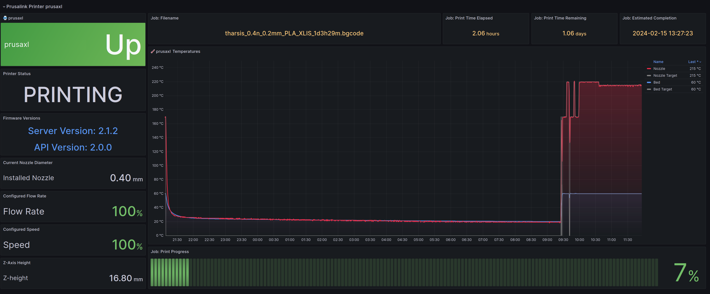

# Prometheus PrusaLink Exporter

Prometheus exporter for the current generation of [PrusaLink-enabled](https://github.com/prusa3d/Prusa-Link-Web) Prusa 3D Printers, written in Python.

ORIGINAL PRUSA is a trademark of [Prusa Development a.s., CZ](https://www.prusa3d.com/en/page/about-us_77/)

## Printer Support

So far, this project has only been tested on the following printers:

| Printer                                                        | Firmware | Prusalink Version | Supported          |
|----------------------------------------------------------------|----------|-------------------|--------------------|
| [Prusa XL](https://www.prusa3d.com/product/original-prusa-xl/) | 5.1.2    | 2.1.2             | :white_check_mark: |

## Installation

### Prerequesites

In addition to standard Python, you'll need:

- [prometheus-client](https://github.com/prometheus/client_python)
- requests
- yaml

Either install these manually, or use `pip install -r requirements.txt`

## Configuration

Make a configuration file using the `config.example.yaml` example file provided. This file will contain your printer's username and password, so keep it safe!

## Running

Launch the exporter by running

```shell
$ ./prusalink_exporter.py --config /path/to/config.yaml
```

You can also daemonize it using the provided systemd unit file, or using another method of your choosing.

## Using the Exporter

### Prometheus

Here's an example Prometheus job spec to read metrics from `prusalink_exporter.py` that's running alongside prometheus:

```YAML
- job_name: prusalink
  static_configs:
    - targets:
      - 127.0.0.1:9528
```

### Metrics

| Metric                            | Description                                             |
|-----------------------------------|---------------------------------------------------------|
| prusalink_scrape_successful       | Indicates if the scrape from the printer was successful |
| prusalink_server_firmware_version | Prusa Firmware Running on the Printer                   |
| prusalink_printer_state           | Current Printer State                                   |
| prusalink_nozzle_diameter         | Nozzle Diameter in mm                                   |
| prusalink_speed                   | Current Printer Configured Speed in Percent             |
| prusalink_flow_rate               | Current Printer Configured Flow Rate in Percent         |
| prusalink_bed_temp_current        | Current Printer Bed Temperature in Celcius              |
| prusalink_bed_temp_desired        | Set (Desired) Printer Bed Temperature in Celcius        |
| prusalink_nozzle_temp_current     | Current Extruder Nozzle Temperature in Celcius          |
| prusalink_nozzle_temp_desired     | Set (Desired) Extruder Nozzle Temperature in Celcius    |
| prusalink_axis_z                  | Current Z Axis Position in mm                           |
| prusalink_job_progress            | Current Job Progress in Percent                         |
| prusalink_job_time_elapsed        | Current Job Elapsed Time Printing in Seconds            |
| prusalink_job_time_remaining      | Current Job Time Remaining in Seconds                   |
| prusalink_job_info                | Information on the Current Active Job                   |

### Grafana

You can deploy the included example [dashboard.json](dashboard.json) to your Grafana instance to visualize the metrics reported by prometheus-prusalink-exporter.



### Alertmanager

You can also set up alerts for [prometheus-alertmanager](https://github.com/prometheus/alertmanager) using the included [alertmanager/prusalink.yml](alertmanager/prusalink.yml) file as a guide.


## License

This work is an open-sourced software project, licensed under the [GPL-3](LICENSE)
